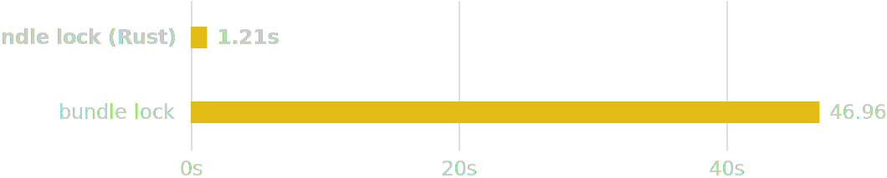
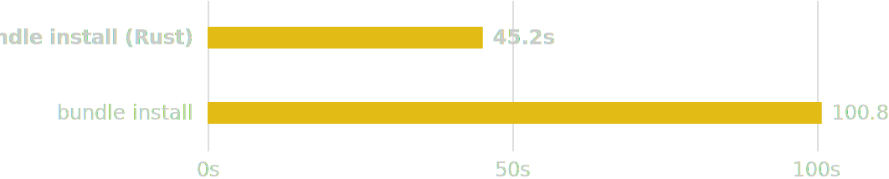

# [WIP] bundle

A blazing fast Ruby Bundler and RubyGems, written in Rust

> **Note:** This project is still under active development and intended for experimental use only.

    <picture>
        <source media="(prefers-color-scheme: dark)" srcset="./resources/benchmark_small_resolution_dark.svg">
        <source media="(prefers-color-scheme: light)" srcset="./resources/benchmark_small_resolution_light.svg">
        
    </picture>

    <picture>
        <source media="(prefers-color-scheme: dark)" srcset="./resources/benchmark_small_installation_dark.svg">
        <source media="(prefers-color-scheme: light)" srcset="./resources/benchmark_small_installation_light.svg">
        
    </picture>

