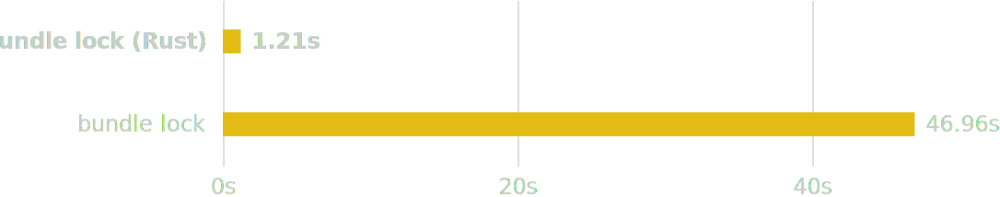

# [WIP] bundle

A blazing fast Rust Bundler and RubyGems, written in Rust

> **Note:** This project is still under active development and intended for experimental use only.

<picture align="center">
    <source media="(prefers-color-scheme: dark)" srcset="./resources/benchmark_small_resolution_dark.svg">
    <source media="(prefers-color-scheme: light)" srcset="./resources/benchmark_small_resolution_light.svg">
    
</picture>

<picture align="center">
    <source media="(prefers-color-scheme: dark)" srcset="./resources/benchmark_small_installation_dark.svg">
    <source media="(prefers-color-scheme: light)" srcset="./resources/benchmark_small_installation_light.svg">
    
</picture>
